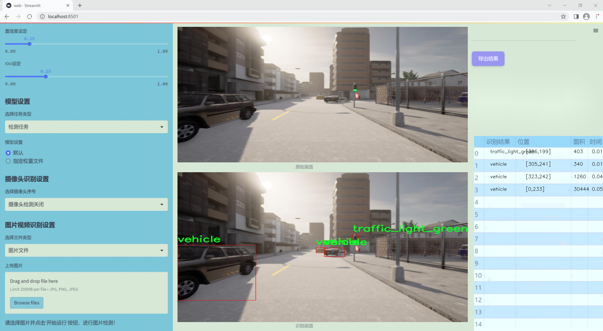

# 改进yolo11-DCNV2等200+全套创新点大全：交通场景智能监测系统源码＆数据集全套

### 1.图片效果展示




##### 项目来源 **[人工智能促进会 2024.10.30](https://kdocs.cn/l/cszuIiCKVNis)**

注意：由于项目一直在更新迭代，上面“1.图片效果展示”和“2.视频效果展示”展示的系统图片或者视频可能为老版本，新版本在老版本的基础上升级如下：（实际效果以升级的新版本为准）

  （1）适配了YOLOV11的“目标检测”模型和“实例分割”模型，通过加载相应的权重（.pt）文件即可自适应加载模型。

  （2）支持“图片识别”、“视频识别”、“摄像头实时识别”三种识别模式。

  （3）支持“图片识别”、“视频识别”、“摄像头实时识别”三种识别结果保存导出，解决手动导出（容易卡顿出现爆内存）存在的问题，识别完自动保存结果并导出到tempDir中。

  （4）支持Web前端系统中的标题、背景图等自定义修改。

  另外本项目提供训练的数据集和训练教程,暂不提供权重文件（best.pt）,需要您按照教程进行训练后实现图片演示和Web前端界面演示的效果。

### 2.视频效果展示

[2.1 视频效果展示](https://www.bilibili.com/video/BV1jVSqYYERt/)

### 3.背景

研究背景与意义

随着城市化进程的加快，交通管理面临着前所未有的挑战。交通事故频发、交通拥堵严重以及环境污染等问题日益突出，亟需借助先进的技术手段进行有效的监测与管理。近年来，计算机视觉和深度学习技术的迅猛发展为交通场景的智能监测提供了新的解决方案。其中，YOLO（You Only Look Once）系列模型因其高效的实时目标检测能力而受到广泛关注。YOLOv11作为该系列的最新版本，具备更强的特征提取能力和更快的推理速度，适合应用于复杂的交通场景中。

本研究旨在基于改进的YOLOv11模型，构建一个高效的交通场景智能监测系统。该系统将利用包含1700张图像的数据集，涵盖了多个交通元素，如自行车、摩托车、行人、交通信号灯及交通标志等。通过对这些类别的精准检测与识别，系统能够实时监测交通流量、识别交通违规行为，并为交通管理部门提供数据支持。这不仅有助于提高交通安全性，减少事故发生率，还有助于优化交通信号控制，缓解交通拥堵问题。

此外，智能监测系统的实现还将推动智能交通系统的发展，为城市交通管理提供智能化、数据化的解决方案。通过对交通场景的全面监测与分析，能够为城市规划、交通政策制定提供科学依据，进而提升城市交通管理的智能化水平。因此，本研究不仅具有重要的学术价值，也对实际交通管理具有深远的社会意义。

### 4.数据集信息展示

##### 4.1 本项目数据集详细数据（类别数＆类别名）

nc: 10
names: ['bike', 'motobike', 'person', 'traffic_light_green', 'traffic_light_orange', 'traffic_light_red', 'traffic_sign_30', 'traffic_sign_60', 'traffic_sign_90', 'vehicle']


该项目为【目标检测】数据集，请在【训练教程和Web端加载模型教程（第三步）】这一步的时候按照【目标检测】部分的教程来训练

##### 4.2 本项目数据集信息介绍

本项目数据集信息介绍

本项目所使用的数据集名为“FYP2022”，旨在为改进YOLOv11的交通场景智能监测系统提供强有力的支持。该数据集包含10个类别，涵盖了交通监测中常见的元素，具体类别包括：自行车（bike）、摩托车（motobike）、行人（person）、绿色交通信号灯（traffic_light_green）、橙色交通信号灯（traffic_light_orange）、红色交通信号灯（traffic_light_red）、30公里限速标志（traffic_sign_30）、60公里限速标志（traffic_sign_60）、90公里限速标志（traffic_sign_90）以及车辆（vehicle）。这些类别的设置不仅考虑到了交通场景的多样性，还特别关注了交通安全与管理的关键要素。

在数据集的构建过程中，充分考虑了不同交通环境下的复杂性与多变性，确保了数据的多样性和代表性。数据集中的图像样本涵盖了城市街道、乡村道路、交叉口等多种场景，能够有效模拟真实世界中的交通状况。此外，数据集中的标注信息经过严格审核，确保每个类别的准确性和一致性，以便为YOLOv11模型的训练提供高质量的输入。

通过使用“FYP2022”数据集，我们期望能够提升YOLOv11在交通场景智能监测中的性能，使其在目标检测、分类及实时监控等方面表现更加出色。数据集的设计不仅为模型的训练提供了坚实的基础，也为后续的交通安全研究和智能交通系统的优化奠定了重要的理论和实践依据。


### 5.全套项目环境部署视频教程（零基础手把手教学）

[5.1 所需软件PyCharm和Anaconda安装教程（第一步）](https://www.bilibili.com/video/BV1BoC1YCEKi/?spm_id_from=333.999.0.0&vd_source=bc9aec86d164b67a7004b996143742dc)


[5.2 安装Python虚拟环境创建和依赖库安装视频教程（第二步）](https://www.bilibili.com/video/BV1ZoC1YCEBw?spm_id_from=333.788.videopod.sections&vd_source=bc9aec86d164b67a7004b996143742dc)

### 6.改进YOLOv11训练教程和Web_UI前端加载模型教程（零基础手把手教学）

[6.1 改进YOLOv11训练教程和Web_UI前端加载模型教程（第三步）](https://www.bilibili.com/video/BV1BoC1YCEhR?spm_id_from=333.788.videopod.sections&vd_source=bc9aec86d164b67a7004b996143742dc)


按照上面的训练视频教程链接加载项目提供的数据集，运行train.py即可开始训练



     Epoch   gpu_mem       box       obj       cls    labels  img_size
     1/200     20.8G   0.01576   0.01955  0.007536        22      1280: 100%|██████████| 849/849 [14:42<00:00,  1.04s/it]
               Class     Images     Labels          P          R     mAP@.5 mAP@.5:.95: 100%|██████████| 213/213 [01:14<00:00,  2.87it/s]
                 all       3395      17314      0.994      0.957      0.0957      0.0843

     Epoch   gpu_mem       box       obj       cls    labels  img_size
     2/200     20.8G   0.01578   0.01923  0.007006        22      1280: 100%|██████████| 849/849 [14:44<00:00,  1.04s/it]
               Class     Images     Labels          P          R     mAP@.5 mAP@.5:.95: 100%|██████████| 213/213 [01:12<00:00,  2.95it/s]
                 all       3395      17314      0.996      0.956      0.0957      0.0845

     Epoch   gpu_mem       box       obj       cls    labels  img_size
     3/200     20.8G   0.01561    0.0191  0.006895        27      1280: 100%|██████████| 849/849 [10:56<00:00,  1.29it/s]
               Class     Images     Labels          P          R     mAP@.5 mAP@.5:.95: 100%|███████   | 187/213 [00:52<00:00,  4.04it/s]
                 all       3395      17314      0.996      0.957      0.0957      0.0845


###### [项目数据集下载链接](https://kdocs.cn/l/cszuIiCKVNis)

### 7.原始YOLOv11算法讲解

YOLO11采用改进的骨干和颈部架构，增强了特征提取能力，提高了物体检测的精确度和复杂任务的表现。YOLO11引入精炼的架构设计和优化的训练流程，实现更快的处理速度，同时保持精度和性能之间的最佳平衡。通过模型设计的进步，YOLO11m在COCO数据集上实现了更高的均值平均精度（mAP），同时使用比YOLOv8m少22%的参数，使其在不妥协准确性的情况下更加计算高效。YOLO11可以无缝部署在各种环境中，包括边缘设备、云平台以及支持NVIDIA
GPU的系统，确保最大灵活性。无论是物体检测、实例分割、图像分类、姿态估计，还是定向物体检测（OBB），YOLO11都旨在应对多样的计算机视觉挑战。


##### **Ultralytics YOLO11相比于之前版本的主要改进有哪些？**

Ultralytics YOLO11在其前身基础上引入了几项重要进步。主要改进包括：

  1. **增强的特征提取** ：YOLO11采用改进的骨干和颈部架构，增强了特征提取能力，提高了物体检测的精确度。
  2.  **优化的效率和速度** ：精炼的架构设计和优化的训练流程实现了更快的处理速度，同时保持了准确性和性能之间的平衡。
  3.  **更高的准确性与更少的参数** ：YOLO11m在COCO数据集上实现了更高的均值平均精度（mAP），同时使用比YOLOv8m少22%的参数，使其在不妥协准确性的情况下更加计算高效。
  4.  **环境适应性强** ：YOLO11可以在多种环境中部署，包括边缘设备、云平台以及支持NVIDIA GPU的系统。
  5.  **支持广泛的任务** ：YOLO11支持多种计算机视觉任务，如物体检测、实例分割、图像分类、姿态估计和定向物体检测（OBB）。

我们先来看一下其网络结构有什么变化，可以看出，相比较于YOLOv8模型，其将CF2模块改成C3K2，同时在SPPF模块后面添加了一个C2PSA模块，且将YOLOv10的head思想引入到YOLO11的head中，使用深度可分离的方法，减少冗余计算，提高效率。下面我们来详细看一下这两个模块的结构是怎么构成的，以及它们为什么要这样设计


##### C3K2的网络结构

从下面图中我们可以看到，C3K2模块其实就是C2F模块转变出来的，它代码中有一个设置，就是当c3k这个参数为FALSE的时候，C3K2模块就是C2F模块，也就是说它的Bottleneck是普通的Bottleneck；反之当它为true的时候，将Bottleneck模块替换成C3模块。


##### C2PSA的网络结构

` `C2PSA是对 `C2f` 模块的扩展，它结合了PSA(Pointwise Spatial
Attention)块，用于增强特征提取和注意力机制。通过在标准 `C2f` 模块中引入 PSA
块，C2PSA实现了更强大的注意力机制，从而提高了模型对重要特征的捕捉能力。


##### **C2f 模块回顾：**

**** C2f模块是一个更快的 CSP（Cross Stage Partial）瓶颈实现，它通过两个卷积层和多个 Bottleneck
块进行特征提取。相比传统的 CSPNet，C2f 优化了瓶颈层的结构，使得计算速度更快。在 C2f中，`cv1` 是第一个 1x1
卷积，用于减少通道数；`cv2` 是另一个 1x1 卷积，用于恢复输出通道数。而 `n` 是一个包含 Bottleneck 块的数量，用于提取特征。

##### **C2PSA 模块的增强** ：

**C2PSA** 扩展了 C2f，通过引入PSA( **Position-Sensitive Attention)**
，旨在通过多头注意力机制和前馈神经网络来增强特征提取能力。它可以选择性地添加残差结构（shortcut）以优化梯度传播和网络训练效果。同时，使用FFN
可以将输入特征映射到更高维的空间，捕获输入特征的复杂非线性关系，允许模型学习更丰富的特征表示。

##### head部分

YOLO11在head部分的cls分支上使用深度可分离卷积 ，具体代码如下，cv2边界框回归分支，cv3分类分支。

    
    
     self.cv2 = nn.ModuleList(
                nn.Sequential(Conv(x, c2, 3), Conv(c2, c2, 3), nn.Conv2d(c2, 4 * self.reg_max, 1)) for x in ch
            )
            self.cv3 = nn.ModuleList(
                nn.Sequential(
                    nn.Sequential(DWConv(x, x, 3), Conv(x, c3, 1)),
                    nn.Sequential(DWConv(c3, c3, 3), Conv(c3, c3, 1)),
                    nn.Conv2d(c3, self.nc, 1),
                )
                for x in ch
            )


### 8.200+种全套改进YOLOV11创新点原理讲解

#### 8.1 200+种全套改进YOLOV11创新点原理讲解大全

由于篇幅限制，每个创新点的具体原理讲解就不全部展开，具体见下列网址中的改进模块对应项目的技术原理博客网址【Blog】（创新点均为模块化搭建，原理适配YOLOv5~YOLOv11等各种版本）

[改进模块技术原理博客【Blog】网址链接](https://gitee.com/qunmasj/good)


#### 8.2 精选部分改进YOLOV11创新点原理讲解

###### 这里节选部分改进创新点展开原理讲解(完整的改进原理见上图和[改进模块技术原理博客链接](https://gitee.com/qunmasj/good)【如果此小节的图加载失败可以通过CSDN或者Github搜索该博客的标题访问原始博客，原始博客图片显示正常】
### CBAM空间注意力机制
近年来，随着深度学习研究方向的火热，注意力机制也被广泛地应用在图像识别、语音识别和自然语言处理等领域，注意力机制在深度学习任务中发挥着举足轻重的作用。注意力机制借鉴于人类的视觉系统，例如，人眼在看到一幅画面时，会倾向于关注画面中的重要信息，而忽略其他可见的信息。深度学习中的注意力机制和人类视觉的注意力机制相似，通过扫描全局数据，从大量数据中选择出需要重点关注的、对当前任务更为重要的信息，然后对这部分信息分配更多的注意力资源，从这些信息中获取更多所需要的细节信息，而抑制其他无用的信息。而在深度学习中，则具体表现为给感兴趣的区域更高的权重，经过网络的学习和调整，得到最优的权重分配，形成网络模型的注意力，使网络拥有更强的学习能力，加快网络的收敛速度。
注意力机制通常可分为软注意力机制和硬注意力机制[4-5]。软注意力机制在选择信息时，不是从输入的信息中只选择1个，而会用到所有输入信息，只是各个信息对应的权重分配不同，然后输入网络模型进行计算;硬注意力机制则是从输入的信息中随机选取一个或者选择概率最高的信息，但是这一步骤通常是不可微的，导致硬注意力机制更难训练。因此，软注意力机制应用更为广泛，按照原理可将软注意力机制划分为:通道注意力机制（channel attention)、空间注意力机制(spatial attention）和混合域注意力机制(mixed attention)。
通道注意力机制的本质建立各个特征通道之间的重要程度，对感兴趣的通道进行重点关注，弱化不感兴趣的通道的作用;空间注意力的本质则是建模了整个空间信息的重要程度，然后对空间内感兴趣的区域进行重点关注，弱化其余非感兴趣区域的作用;混合注意力同时运用了通道注意力和空间注意力，两部分先后进行或并行，形成对通道特征和空间特征同时关注的注意力模型。

卷积层注意力模块(Convolutional Block Attention Module，CBAM）是比较常用的混合注意力模块，其先后集中了通道注意力模块和空间注意力模块，网络中加入该模块能有效提高网络性能，减少网络模型的计算量，模块结构如图所示。输入特征图首先经过分支的通道注意力模块，然后和主干的原特征图融合，得到具有通道注意力的特征图，接着经过分支的空间注意力模块，在和主干的特征图融合后，得到同时具有通道特征注意力和空间特征注意力的特征图。CBAM模块不改变输入特征图的大小，因此该模块是一个“即插即用”的模块，可以插入网络的任何位置。

通道注意力模块的结构示意图如图所示，通道注意力模块分支并行地对输入的特征图进行最大池化操作和平均池化操作，然后利用多层感知机对结果进行变换，得到应用于两个通道的变换结果，最后经过sigmoid激活函数将变换结果融合，得到具有通道注意力的通道特征图。

空间注意力模块示意图如图所示，将通道注意力模块输出的特征图作为该模块的输入特征图，首先对输入特征图进行基于通道的最大池化操作和平均池化操作，将两部分得到的结果拼接起来，然后通过卷积得到降为Ⅰ通道的特征图，最后通过sigmoid激活函数生成具有空间注意力的特征图。


### 9.系统功能展示

图9.1.系统支持检测结果表格显示

  图9.2.系统支持置信度和IOU阈值手动调节

  图9.3.系统支持自定义加载权重文件best.pt(需要你通过步骤5中训练获得)

  图9.4.系统支持摄像头实时识别

  图9.5.系统支持图片识别

  图9.6.系统支持视频识别

  图9.7.系统支持识别结果文件自动保存

  图9.8.系统支持Excel导出检测结果数据


### 10. YOLOv11核心改进源码讲解

#### 10.1 fast_kan_conv.py

以下是代码中最核心的部分，并添加了详细的中文注释：

```python
import torch
import torch.nn as nn

class RadialBasisFunction(nn.Module):
    def __init__(self, grid_min: float = -2., grid_max: float = 2., num_grids: int = 8, denominator: float = None):
        """
        初始化径向基函数（RBF）模块。
        
        参数：
        - grid_min: 网格的最小值
        - grid_max: 网格的最大值
        - num_grids: 网格的数量
        - denominator: 用于平滑基函数的分母
        """
        super().__init__()
        # 创建一个线性空间的网格
        grid = torch.linspace(grid_min, grid_max, num_grids)
        self.grid = torch.nn.Parameter(grid, requires_grad=False)  # 将网格设置为不可训练的参数
        self.denominator = denominator or (grid_max - grid_min) / (num_grids - 1)  # 设置分母

    def forward(self, x):
        """
        前向传播函数，计算径向基函数的输出。
        
        参数：
        - x: 输入张量
        
        返回：
        - 计算得到的径向基函数值
        """
        return torch.exp(-((x[..., None] - self.grid) / self.denominator) ** 2)  # 计算RBF值


class FastKANConvNDLayer(nn.Module):
    def __init__(self, conv_class, norm_class, input_dim, output_dim, kernel_size, groups=1, padding=0, stride=1, dilation=1, ndim: int = 2, grid_size=8, base_activation=nn.SiLU, grid_range=[-2, 2], dropout=0.0):
        """
        初始化FastKAN卷积层。
        
        参数：
        - conv_class: 卷积层的类
        - norm_class: 归一化层的类
        - input_dim: 输入维度
        - output_dim: 输出维度
        - kernel_size: 卷积核大小
        - groups: 分组数
        - padding: 填充
        - stride: 步幅
        - dilation: 膨胀
        - ndim: 维度（1D, 2D, 3D）
        - grid_size: 网格大小
        - base_activation: 基础激活函数
        - grid_range: 网格范围
        - dropout: dropout比例
        """
        super(FastKANConvNDLayer, self).__init__()
        self.inputdim = input_dim
        self.outdim = output_dim
        self.kernel_size = kernel_size
        self.padding = padding
        self.stride = stride
        self.dilation = dilation
        self.groups = groups
        self.ndim = ndim
        self.grid_size = grid_size
        self.base_activation = base_activation()  # 初始化基础激活函数
        self.grid_range = grid_range

        # 检查参数有效性
        if groups <= 0:
            raise ValueError('groups must be a positive integer')
        if input_dim % groups != 0:
            raise ValueError('input_dim must be divisible by groups')
        if output_dim % groups != 0:
            raise ValueError('output_dim must be divisible by groups')

        # 创建基础卷积层和样条卷积层
        self.base_conv = nn.ModuleList([conv_class(input_dim // groups, output_dim // groups, kernel_size, stride, padding, dilation, groups=1, bias=False) for _ in range(groups)])
        self.spline_conv = nn.ModuleList([conv_class(grid_size * input_dim // groups, output_dim // groups, kernel_size, stride, padding, dilation, groups=1, bias=False) for _ in range(groups)])

        # 创建归一化层
        self.layer_norm = nn.ModuleList([norm_class(output_dim // groups) for _ in range(groups)])

        # 初始化径向基函数
        self.rbf = RadialBasisFunction(grid_range[0], grid_range[1], grid_size)

        # 初始化dropout层
        self.dropout = None
        if dropout > 0:
            if ndim == 1:
                self.dropout = nn.Dropout1d(p=dropout)
            if ndim == 2:
                self.dropout = nn.Dropout2d(p=dropout)
            if ndim == 3:
                self.dropout = nn.Dropout3d(p=dropout)

        # 使用Kaiming均匀分布初始化卷积层权重
        for conv_layer in self.base_conv:
            nn.init.kaiming_uniform_(conv_layer.weight, nonlinearity='linear')

        for conv_layer in self.spline_conv:
            nn.init.kaiming_uniform_(conv_layer.weight, nonlinearity='linear')

    def forward_fast_kan(self, x, group_index):
        """
        快速KAN前向传播函数。
        
        参数：
        - x: 输入张量
        - group_index: 当前组的索引
        
        返回：
        - 输出张量
        """
        # 应用基础激活函数并进行线性变换
        base_output = self.base_conv[group_index](self.base_activation(x))
        if self.dropout is not None:
            x = self.dropout(x)  # 应用dropout
        spline_basis = self.rbf(self.layer_norm[group_index](x))  # 计算样条基
        spline_basis = spline_basis.moveaxis(-1, 2).flatten(1, 2)  # 调整维度
        spline_output = self.spline_conv[group_index](spline_basis)  # 计算样条卷积输出
        x = base_output + spline_output  # 合并基础输出和样条输出

        return x

    def forward(self, x):
        """
        前向传播函数，处理输入张量。
        
        参数：
        - x: 输入张量
        
        返回：
        - 输出张量
        """
        split_x = torch.split(x, self.inputdim // self.groups, dim=1)  # 按组分割输入
        output = []
        for group_ind, _x in enumerate(split_x):
            y = self.forward_fast_kan(_x.clone(), group_ind)  # 对每组进行快速KAN前向传播
            output.append(y.clone())
        y = torch.cat(output, dim=1)  # 合并所有组的输出
        return y
```

在上述代码中，`RadialBasisFunction`类实现了径向基函数的计算，而`FastKANConvNDLayer`类则实现了一个通用的卷积层，支持多维卷积操作。通过`forward`方法进行前向传播，处理输入数据并返回输出。

这个文件定义了一个名为 `fast_kan_conv.py` 的深度学习模块，主要实现了快速的 KAN 卷积层，支持一维、二维和三维卷积。文件中包含几个类，分别用于实现径向基函数（Radial Basis Function）和不同维度的卷积层。

首先，`RadialBasisFunction` 类是一个自定义的神经网络模块，用于生成径向基函数。它的构造函数接受网格的最小值、最大值、网格数量和分母参数。网格是通过 `torch.linspace` 函数生成的，并且被定义为一个不可训练的参数。`forward` 方法实现了径向基函数的计算，输入 `x` 会被转换为一个与网格相对的高斯分布。

接下来，`FastKANConvNDLayer` 类是一个通用的卷积层实现，支持多维卷积。它的构造函数接收多个参数，包括输入和输出维度、卷积核大小、分组数、填充、步幅、扩张、网格大小、基础激活函数、网格范围和 dropout 比例。该类首先检查输入参数的有效性，然后初始化基础卷积层、样条卷积层、层归一化层和径向基函数模块。对于每个卷积层，使用 Kaiming 均匀分布初始化权重，以帮助模型更好地训练。

`forward_fast_kan` 方法是该类的核心，它接受输入 `x` 和组索引 `group_index`，首先对输入应用基础激活函数，然后通过基础卷积层进行线性变换。接着，如果设置了 dropout，则对输入进行 dropout 操作。然后计算样条基函数，并通过样条卷积层得到输出，最后将基础输出和样条输出相加，返回最终结果。

`forward` 方法负责处理多组输入数据。它将输入 `x` 按照组数进行分割，并对每一组调用 `forward_fast_kan` 方法，最后将所有组的输出拼接在一起。

文件中还定义了三个子类，分别是 `FastKANConv3DLayer`、`FastKANConv2DLayer` 和 `FastKANConv1DLayer`，它们分别继承自 `FastKANConvNDLayer`，并在构造函数中指定了相应的卷积类型（3D、2D、1D）和归一化类型（实例归一化）。

整体来看，这个文件实现了一个灵活且高效的卷积层，能够处理不同维度的输入，并通过径向基函数和样条卷积的结合，提升了模型的表达能力。

#### 10.2 mamba_vss.py

以下是代码中最核心的部分，并附上详细的中文注释：

```python
import torch
import torch.nn as nn
import torch.nn.functional as F
from einops import repeat
from timm.layers import DropPath

class SS2D(nn.Module):
    def __init__(self, d_model, d_state=16, d_conv=3, expand=2, dropout=0., device=None, dtype=None):
        super().__init__()
        # 初始化模型参数
        self.d_model = d_model  # 输入特征维度
        self.d_state = d_state  # 状态维度
        self.d_conv = d_conv  # 卷积核大小
        self.expand = expand  # 扩展因子
        self.d_inner = int(self.expand * self.d_model)  # 内部特征维度

        # 输入线性变换
        self.in_proj = nn.Linear(self.d_model, self.d_inner * 2)
        # 卷积层
        self.conv2d = nn.Conv2d(in_channels=self.d_inner, out_channels=self.d_inner, groups=self.d_inner, kernel_size=d_conv, padding=(d_conv - 1) // 2)
        self.act = nn.SiLU()  # 激活函数

        # 状态和时间步长的线性变换
        self.x_proj_weight = nn.Parameter(torch.empty(4, self.d_inner, self.d_state * 2))  # (K=4, N, inner)
        self.dt_projs_weight = nn.Parameter(torch.empty(4, self.d_inner, self.d_state))  # (K=4, inner, rank)
        self.dt_projs_bias = nn.Parameter(torch.empty(4, self.d_inner))  # (K=4, inner)

        # 初始化状态和时间步长的参数
        self.A_logs = self.A_log_init(self.d_state, self.d_inner, copies=4)  # (K=4, D, N)
        self.Ds = self.D_init(self.d_inner, copies=4)  # (K=4, D, N)

        self.out_norm = nn.LayerNorm(self.d_inner)  # 输出归一化
        self.out_proj = nn.Linear(self.d_inner, self.d_model)  # 输出线性变换
        self.dropout = nn.Dropout(dropout) if dropout > 0. else None  # dropout层

    def forward(self, x: torch.Tensor):
        # 前向传播
        B, H, W, C = x.shape  # 获取输入的形状
        xz = self.in_proj(x)  # 输入线性变换
        x, z = xz.chunk(2, dim=-1)  # 分割为x和z

        x = x.permute(0, 3, 1, 2).contiguous()  # 调整维度以适应卷积
        x = self.act(self.conv2d(x))  # 卷积和激活
        y = self.forward_core(x)  # 核心前向计算
        y = y * F.silu(z)  # 与z进行逐元素相乘
        out = self.out_proj(y)  # 输出线性变换
        if self.dropout is not None:
            out = self.dropout(out)  # 应用dropout
        return out

    def forward_core(self, x: torch.Tensor):
        # 核心前向计算逻辑
        B, C, H, W = x.shape
        L = H * W
        K = 4

        # 将输入x进行处理
        x_hwwh = torch.stack([x.view(B, -1, L), torch.transpose(x, dim0=2, dim1=3).contiguous().view(B, -1, L)], dim=1).view(B, 2, -1, L)
        xs = torch.cat([x_hwwh, torch.flip(x_hwwh, dims=[-1])], dim=1)  # (b, k, d, l)

        # 计算时间步长和状态
        x_dbl = torch.einsum("b k d l, k c d -> b k c l", xs.view(B, K, -1, L), self.x_proj_weight)
        dts, Bs, Cs = torch.split(x_dbl, [self.dt_rank, self.d_state, self.d_state], dim=2)
        dts = torch.einsum("b k r l, k d r -> b k d l", dts.view(B, K, -1, L), self.dt_projs_weight)

        # 进行选择性扫描
        out_y = self.selective_scan(xs, dts, -torch.exp(self.A_logs.float()).view(-1, self.d_state), Bs, Cs, self.Ds.float().view(-1), z=None)
        y = out_y.view(B, K, -1, L)
        y = self.out_norm(y)  # 输出归一化
        return y

class VSSBlock(nn.Module):
    def __init__(self, hidden_dim: int = 0, drop_path: float = 0.2, d_state: int = 16):
        super().__init__()
        self.ln_1 = nn.LayerNorm(hidden_dim)  # 归一化层
        self.self_attention = SS2D(d_model=hidden_dim, d_state=d_state)  # 自注意力层
        self.drop_path = DropPath(drop_path)  # 随机丢弃路径

    def forward(self, input: torch.Tensor):
        input = input.permute((0, 2, 3, 1))  # 调整输入维度
        x = input + self.drop_path(self.self_attention(self.ln_1(input)))  # 残差连接
        return x.permute((0, 3, 1, 2))  # 恢复维度

# 示例代码
if __name__ == '__main__':
    inputs = torch.randn((1, 64, 32, 32)).cuda()  # 创建随机输入
    model = VSSBlock(64).cuda()  # 初始化模型
    pred = model(inputs)  # 前向传播
    print(pred.size())  # 输出预测的形状
```

### 代码说明：
1. **SS2D类**：实现了一个自定义的神经网络模块，包含输入线性变换、卷积层、激活函数和核心前向计算逻辑。
2. **forward方法**：定义了输入数据的前向传播过程，包括线性变换、卷积、激活、核心计算和输出。
3. **forward_core方法**：实现了核心的计算逻辑，主要包括输入的处理、时间步长和状态的计算，以及选择性扫描的应用。
4. **VSSBlock类**：封装了一个包含归一化、自注意力机制和随机丢弃路径的模块，支持残差连接。

该代码的核心部分是自注意力机制的实现和前向传播的逻辑，能够用于处理图像等高维数据。

这个程序文件 `mamba_vss.py` 实现了一个深度学习模型的两个模块：`VSSBlock` 和 `Mamba2Block`，它们都基于 PyTorch 框架构建。文件中包含了多个类和方法，主要用于构建自注意力机制的神经网络。

首先，程序导入了必要的库，包括 PyTorch 及其相关模块、数学函数、以及一些辅助函数和类。接着，定义了一个名为 `SS2D` 的类，它是一个核心组件，主要用于实现自注意力机制。这个类的构造函数接受多个参数，如模型维度、状态维度、卷积核大小等，并初始化了相应的层，包括线性层、卷积层和激活函数。

在 `SS2D` 类中，`dt_init`、`A_log_init` 和 `D_init` 等静态方法用于初始化不同的参数，确保在训练开始时这些参数具有合适的值。`forward_corev0` 方法实现了自注意力的核心计算逻辑，使用了选择性扫描的技术来处理输入数据。

接下来，`VSSBlock` 类继承自 `nn.Module`，它实现了一个标准的自注意力块。构造函数中初始化了归一化层、`SS2D` 自注意力层和丢弃路径（DropPath）层。在 `forward` 方法中，输入数据经过归一化和自注意力层的处理后，结合原始输入进行残差连接。

`Mamba2Block` 类同样继承自 `VSSBlock`，但它使用了不同的自注意力实现 `Mamba2Simple`。这个类的 `forward` 方法与 `VSSBlock` 类似，但在处理输入时采用了不同的形状变换。

最后，在文件的主程序部分，创建了随机输入并实例化了 `VSSBlock` 和 `Mamba2Block`，然后进行前向传播以获取输出。这部分代码用于测试模型的基本功能。

总体来说，这个文件实现了一个复杂的自注意力机制模块，适用于处理图像或其他高维数据，能够在深度学习任务中提高模型的表现。

#### 10.3 predict.py

以下是经过简化和注释的核心代码部分：

```python
# 导入必要的模块
from ultralytics.engine.predictor import BasePredictor
from ultralytics.engine.results import Results
from ultralytics.utils import ops

class DetectionPredictor(BasePredictor):
    """
    DetectionPredictor类用于基于检测模型进行预测的扩展类。
    """

    def postprocess(self, preds, img, orig_imgs):
        """
        对预测结果进行后处理，并返回Results对象的列表。

        参数:
        preds: 模型的预测结果
        img: 输入图像
        orig_imgs: 原始图像

        返回:
        results: 包含后处理结果的Results对象列表
        """
        # 应用非极大值抑制（NMS）来过滤重叠的检测框
        preds = ops.non_max_suppression(
            preds,
            self.args.conf,  # 置信度阈值
            self.args.iou,    # IOU阈值
            agnostic=self.args.agnostic_nms,  # 是否类别无关的NMS
            max_det=self.args.max_det,  # 最大检测框数量
            classes=self.args.classes,    # 需要检测的类别
        )

        # 如果输入的原始图像不是列表，则将其转换为numpy数组
        if not isinstance(orig_imgs, list):
            orig_imgs = ops.convert_torch2numpy_batch(orig_imgs)

        results = []  # 初始化结果列表
        for i, pred in enumerate(preds):
            orig_img = orig_imgs[i]  # 获取对应的原始图像
            # 将预测框的坐标缩放到原始图像的尺寸
            pred[:, :4] = ops.scale_boxes(img.shape[2:], pred[:, :4], orig_img.shape)
            img_path = self.batch[0][i]  # 获取图像路径
            # 创建Results对象并添加到结果列表
            results.append(Results(orig_img, path=img_path, names=self.model.names, boxes=pred))
        
        return results  # 返回后处理结果
```

### 代码说明：
1. **导入模块**：导入必要的类和函数以支持模型预测和结果处理。
2. **DetectionPredictor类**：继承自`BasePredictor`，用于处理检测模型的预测。
3. **postprocess方法**：该方法对模型的预测结果进行后处理，主要步骤包括：
   - 应用非极大值抑制（NMS）来去除重叠的检测框。
   - 检查原始图像格式并进行必要的转换。
   - 遍历每个预测结果，缩放预测框到原始图像的尺寸，并创建`Results`对象以存储最终结果。
4. **返回结果**：返回包含所有处理后结果的列表。

这个程序文件 `predict.py` 是一个用于目标检测的预测模块，基于 Ultralytics YOLO（You Only Look Once）模型。文件中定义了一个名为 `DetectionPredictor` 的类，该类继承自 `BasePredictor`，用于处理目标检测任务的预测。

在类的文档字符串中，提供了一个使用示例，展示了如何创建 `DetectionPredictor` 的实例并调用其 `predict_cli` 方法进行预测。示例中，模型文件 `yolov8n.pt` 和数据源 `ASSETS` 被传递给构造函数，以初始化预测器。

类中包含一个名为 `postprocess` 的方法，该方法用于对模型的预测结果进行后处理。具体来说，该方法接受三个参数：`preds`（模型的预测结果）、`img`（输入图像）和 `orig_imgs`（原始图像）。在方法内部，首先使用 `ops.non_max_suppression` 函数对预测结果进行非极大值抑制，以去除冗余的检测框，确保最终返回的框是最优的。

接下来，方法检查 `orig_imgs` 是否为列表，如果不是，则将其转换为 NumPy 数组格式，以便后续处理。然后，方法遍历每个预测结果，并根据原始图像的尺寸调整检测框的位置和大小。每个处理后的结果都被封装在 `Results` 对象中，并包含原始图像、图像路径、模型的类别名称以及检测框信息。

最后，处理后的结果以列表的形式返回，便于后续的分析和可视化。整体上，这个文件实现了一个完整的目标检测预测流程，从模型加载到结果后处理，适用于使用 YOLO 模型进行实时或批量图像分析的场景。

#### 10.4 VanillaNet.py

以下是经过简化并添加详细中文注释的核心代码部分：

```python
import torch
import torch.nn as nn
import torch.nn.functional as F
from timm.layers import weight_init

# 定义激活函数类
class Activation(nn.ReLU):
    def __init__(self, dim, act_num=3, deploy=False):
        super(Activation, self).__init__()
        self.deploy = deploy  # 是否处于部署模式
        # 初始化权重和偏置
        self.weight = torch.nn.Parameter(torch.randn(dim, 1, act_num * 2 + 1, act_num * 2 + 1))
        self.bias = None
        self.bn = nn.BatchNorm2d(dim, eps=1e-6)  # 批归一化
        self.dim = dim
        self.act_num = act_num
        weight_init.trunc_normal_(self.weight, std=.02)  # 权重初始化

    def forward(self, x):
        # 前向传播
        if self.deploy:
            return F.conv2d(
                super(Activation, self).forward(x), 
                self.weight, self.bias, padding=(self.act_num * 2 + 1) // 2, groups=self.dim)
        else:
            return self.bn(F.conv2d(
                super(Activation, self).forward(x),
                self.weight, padding=self.act_num, groups=self.dim))

    def switch_to_deploy(self):
        # 切换到部署模式
        if not self.deploy:
            kernel, bias = self._fuse_bn_tensor(self.weight, self.bn)
            self.weight.data = kernel
            self.bias = torch.nn.Parameter(torch.zeros(self.dim))
            self.bias.data = bias
            self.__delattr__('bn')  # 删除bn属性
            self.deploy = True

    def _fuse_bn_tensor(self, weight, bn):
        # 融合权重和批归一化参数
        kernel = weight
        running_mean = bn.running_mean
        running_var = bn.running_var
        gamma = bn.weight
        beta = bn.bias
        eps = bn.eps
        std = (running_var + eps).sqrt()
        t = (gamma / std).reshape(-1, 1, 1, 1)
        return kernel * t, beta + (0 - running_mean) * gamma / std

# 定义基本模块类
class Block(nn.Module):
    def __init__(self, dim, dim_out, act_num=3, stride=2, deploy=False):
        super().__init__()
        self.deploy = deploy
        # 根据是否部署选择不同的卷积结构
        if self.deploy:
            self.conv = nn.Conv2d(dim, dim_out, kernel_size=1)
        else:
            self.conv1 = nn.Sequential(
                nn.Conv2d(dim, dim, kernel_size=1),
                nn.BatchNorm2d(dim, eps=1e-6),
            )
            self.conv2 = nn.Sequential(
                nn.Conv2d(dim, dim_out, kernel_size=1),
                nn.BatchNorm2d(dim_out, eps=1e-6)
            )
        # 池化层
        self.pool = nn.MaxPool2d(stride) if stride != 1 else nn.Identity()
        self.act = Activation(dim_out, act_num)  # 激活函数

    def forward(self, x):
        # 前向传播
        if self.deploy:
            x = self.conv(x)
        else:
            x = self.conv1(x)
            x = F.leaky_relu(x, negative_slope=1)  # 使用Leaky ReLU激活
            x = self.conv2(x)

        x = self.pool(x)  # 池化
        x = self.act(x)  # 激活
        return x

# 定义VanillaNet模型
class VanillaNet(nn.Module):
    def __init__(self, in_chans=3, num_classes=1000, dims=[96, 192, 384, 768], 
                 drop_rate=0, act_num=3, strides=[2, 2, 2, 1], deploy=False):
        super().__init__()
        self.deploy = deploy
        # 构建网络的stem部分
        if self.deploy:
            self.stem = nn.Sequential(
                nn.Conv2d(in_chans, dims[0], kernel_size=4, stride=4),
                Activation(dims[0], act_num)
            )
        else:
            self.stem1 = nn.Sequential(
                nn.Conv2d(in_chans, dims[0], kernel_size=4, stride=4),
                nn.BatchNorm2d(dims[0], eps=1e-6),
            )
            self.stem2 = nn.Sequential(
                nn.Conv2d(dims[0], dims[0], kernel_size=1, stride=1),
                nn.BatchNorm2d(dims[0], eps=1e-6),
                Activation(dims[0], act_num)
            )

        self.stages = nn.ModuleList()
        for i in range(len(strides)):
            stage = Block(dim=dims[i], dim_out=dims[i + 1], act_num=act_num, stride=strides[i], deploy=deploy)
            self.stages.append(stage)  # 添加每个Block到模型中

    def forward(self, x):
        # 前向传播
        if self.deploy:
            x = self.stem(x)
        else:
            x = self.stem1(x)
            x = F.leaky_relu(x, negative_slope=1)
            x = self.stem2(x)

        for stage in self.stages:
            x = stage(x)  # 通过每个Block
        return x

# 测试模型
if __name__ == '__main__':
    inputs = torch.randn((1, 3, 640, 640))  # 随机输入
    model = VanillaNet()  # 实例化模型
    pred = model(inputs)  # 进行前向传播
    print(pred.size())  # 输出预测结果的尺寸
```

### 代码说明：
1. **Activation 类**：自定义的激活函数类，使用 ReLU 激活，并支持批归一化的融合。
2. **Block 类**：构建网络的基本模块，包含卷积层、池化层和激活函数。
3. **VanillaNet 类**：整体网络结构，包含输入层（stem）和多个 Block 组成的阶段。
4. **前向传播**：定义了输入数据如何通过网络流动，输出最终的特征图。
5. **测试部分**：在主程序中实例化模型并进行一次前向传播，输出结果的尺寸。

这个程序文件`VanillaNet.py`实现了一个名为VanillaNet的深度学习模型，主要用于图像处理任务。代码中使用了PyTorch框架，并定义了一些模块和函数来构建和训练这个模型。

首先，文件中导入了必要的库，包括`torch`和`torch.nn`，以及一些其他的模块。接着，定义了一个名为`activation`的类，继承自`nn.ReLU`，用于实现一种自定义的激活函数。这个类的构造函数中初始化了一些参数，包括权重和偏置，并使用批量归一化（Batch Normalization）来规范化输出。在`forward`方法中，根据模型的部署状态选择不同的计算方式。

接下来，定义了一个`Block`类，它是VanillaNet的基本构建块。这个类的构造函数中根据输入和输出的维度、步幅等参数设置卷积层和池化层。`forward`方法实现了前向传播，依次通过卷积、激活和池化层进行处理。

然后，定义了`VanillaNet`类，这是整个模型的主体。构造函数中根据输入通道数、类别数、特征维度等参数初始化模型的各个部分，包括初始卷积层和多个`Block`模块。`forward`方法实现了模型的前向传播，返回不同尺度的特征图。

此外，文件中还定义了一些辅助函数，例如`update_weight`用于更新模型的权重，`vanillanet_5`到`vanillanet_13_x1_5_ada_pool`等函数用于创建不同配置的VanillaNet模型，并可选择加载预训练权重。

最后，在文件的主程序部分，创建了一个输入张量并实例化了一个VanillaNet模型，进行一次前向传播，并打印输出特征图的尺寸。

整体来看，这个程序文件实现了一个灵活且可扩展的深度学习模型，适用于各种图像处理任务，且支持多种配置和预训练权重的加载。

注意：由于此博客编辑较早，上面“10.YOLOv11核心改进源码讲解”中部分代码可能会优化升级，仅供参考学习，以“11.完整训练+Web前端界面+200+种全套创新点源码、数据集获取”的内容为准。

### 11.完整训练+Web前端界面+200+种全套创新点源码、数据集获取


# [下载链接：https://mbd.pub/o/bread/Zp6YlJtv](https://mbd.pub/o/bread/Zp6YlJtv)